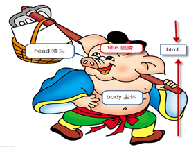

## 课程介绍
1：html    用来写网页结构的（身体的骨骼）

2：css	   网页的美化师（人的衣服）

3：javascript  网页特效与用户交互
## Html概念
Html：  hyper  Text  Markup  Language（超文本标记语言）

超文本： 实现网页跳转的文本（超链接）

标记：  在网页中做记号（html标签）

## Html结构（☆☆☆☆）

~~~
<!doctype  html>
<html>
    <head>
         <title></title>
    </head>
    <body></body>
</html>
~~~

`<!doctype  html>`     告诉浏览器当前文档类型（html）  
 `<html></html>`      根标签
` <head></head>`     定义了头部
 `<title></title>`       网页的名称（标题）    
`<body></body>`     网页主体（网页中看到的所有信息都放在body标签中）
1)	`<title>`标记对不能放在`<body>`标记对中，同理，其它表示内容的标记也不能放在`<head>`标记对中
2)	`<html></html>`表示HTML语言，在`<html></html>`里面包含头部(`<head></head>`)和内容体(`<body></body>`)。
3)	HTML注释表示为`<!--注释内容-->`
## HTML的标记组成
HTML用于描述功能的符号称为“标记”。标记在使用时必须用尖括号“`<>`”括起来，而且是成对出现的，无斜杠的标记表示该标记的作用开始，有斜杠的标记表示该标记的作用结束。如`<body></body>`、`

`等

1)	单标记：有些标记能完整的表达标记里的意思，只须在尖括号中输入标记名即可，这类标记叫单标记。XHTML中要求单标记也必须闭合，即在标记“`>`”前添加斜杠。常见的单标记如` `、`
`等。

2)	双标记：双标记有头有尾，且前面的标记与后面的标记保持一致，但在后面的标记前有斜线，语法形如：`<标记>内容</标记>`。例如：`
段落
`

3)	XHTML要求所有标记均为小写，且所有标记属性必须添加双引号

4)	标记对不能交叉

## Html标签关系分类

1：嵌套关系（父与子）

例如：

~~~
<head>
	<title></title>
</head>
~~~
2:并列关系（兄弟和兄弟之间） 

例如：

~~~
 <head></head>
 <body></body>
~~~

## Html标签分类

1：双标签

有开始标签，有结束标签===》双标签

例如：  `<head></head>`

2: 单标签

只有开始标签，没有结束标签===》单标签

 
