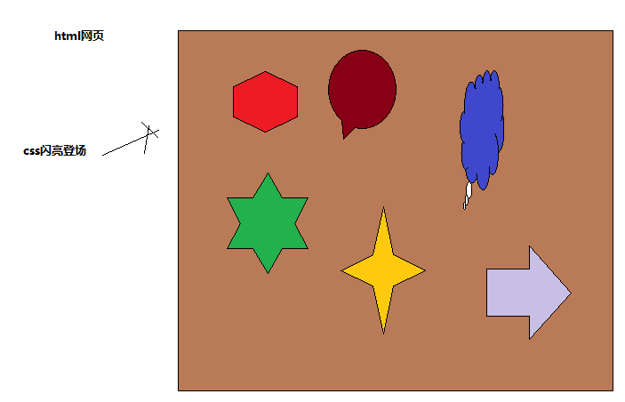
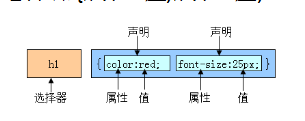
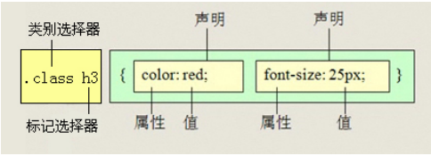

# 认识CSS

## 作用

美化网页（网页的美化师）

1：文字，图片。。。

2：网页布局

## 概念

CSS:  层叠样式表或者叫级联样式表（Cascading Style Sheets）

CSS是以html为基础的。就是给html标签设置属性样式

## CSS与html之间的关系

## Css写法

    选择器{属性:值;属性:值;属性:值;}

## css注释方式

	/*选择器{属性:值;属性:值;属性:值;}*/

# CSS核心基础

## CSS样式规则

## 引入CSS样式表

1. 行内式

2. 内嵌式

	在html页面中，在`<head></head>`标签中添加 ``

		

3. 链入式

4. 导入式

## CSS基础选择器

1. 标记选择器

2. 类选择器

    1. 语法格式

      点（.）+自定义名称{属性:值;}

	2. 用法

       1:  类样式的定义     .+自定义名称{属性:值}

       2:  在标签中使用 class 关键字（属性） 去调用。

	3. 类选择器特点

        1：谁调用谁改变颜色。
        
            <!DOCTYPE html>
            <html lang="en">
            <head>
                <meta charset="UTF-8">
                <title>Document</title>
                
            </head>
            <body>
                   
我是一段文字

                   
我也是一段文字

            </body>
            </html>
 
 
        2：类选择（类名）相当于人的名字（任何标签都可以调用同样的类样式） 

        3：一个标签可以同时调用多个类样式
        
        	
我也是一段文字

	4. 提取公共类
	
    		.two{
				 background-color: yellow;
			}
			.public{
				 width: 100px;
				 height:100px;
			}

       把相同的代码放到一个类中，方便其他标签调用。
 
      5. 命名规范：

         1：不能使用纯数字去定义类名，不能使用数字开头定义类名

      	 2： 不推荐使用中文去定义类名（不能）

         3：不能使用纯特殊字符去定义类名，不能以特殊字符开头

         4：不推荐使用html中标签名	定义类名

         5：有意义的单词描述命名

            头：header、内容：content/container
	    
            尾：footer 、导航：nav  、侧栏：sidebar
	    
            栏目：column、页面外围控制整体布局宽度：wrapper
	    
            左右中：left right center、登录条：loginbar
	    
            标志：logo、广告：banner
	    
            页面主体：main、热点：hot、新闻：news
	    
            下载：download、子导航：subnav
	    
            菜单：menu、子菜单：submenu
	    
            搜索：search、友情链接：friendlink、页脚：footer
	    
            版权：copyright、滚动：scroll、内容：content

3. id选择器

	1. 语法格式

         1：#自定义名称{属性:值;}

         2: 通过标签ID属性调用

	2. ID选择器特点

       1：标签中不能调用多个ID选择器定义的样式

       2：ID相当于人的身份证

      3：一般情况下，ID选择器和JavaScript配合使用，所有有关样式的都使用类选择器和其他选择。

4. 通配符选择器

语法格式

         *{属性:值;}

用途：一般情况下（很少）做页面初始化样式

# CSS文本相关样式

## CSS字体样式属性

1. font-size：字号大小

2. font-family:字体

		font-family:"微软雅黑";

3. font-weight：字体粗细

        font-weight: bold;      /*设置文字加粗*/
        font-weight:700;         /* 设置文字加粗*/
        font-weight: normal;   /*文字正常显示*/

4. font-variant：变体

5. font-style：字体风格

        font-style:italic; /*文字斜体显示*/
        font-style:normal;     /*文字正常显示*/

6. font：综合设置字体样式

		font:font-style  font-weight  font-size/line-height  font-family;
    1：font属性联写 必须有font-size  和font-family
    2: font 属性联写  必须按照顺序写

## CSS文本外观属性

1. color：文本颜色

2. letter-spacing：字间距

3. word-spacing：单词间距

4. line-height：行间距

5. text-transform：文本转换

6. text-decoration：文本装饰

7. text-align：水平对齐方式

8. text-indent：首行缩进

9. white-space：空白符处理

10. background-color：背景色

11. text-indent:2em;	首行缩进2个字

# CSS特性

# 复合选择器

## 标签指定式选择器（☆☆☆☆）

语法格式

        标签名.类名{属性:值;}

既又的关系

例如：

    <!DOCTYPE html>
    <html lang="en">
    <head>
        <meta charset="UTF-8">
        <title>Document</title>
        
    </head>
    <body>
          
阿斯兰地矿局

          
阿斯顿两份会计师

          
asdfsafdsafd

    </body>
    </html>

## 后代选择器（☆☆☆☆）

介绍后代选择器

注意：后代选择器，标签之间一定是嵌套关系（父与子的关系）

	p span{
        color:green;
     }

后代选择器，选择器之间用空格隔开。

## 并集选择器（☆☆☆）

并集选择器语法格式

       选择器,选择器{属性:值;}
       
      <!DOCTYPE html>
    <html lang="en">
    <head>
        <meta charset="UTF-8">
        <title>Document</title>
        
    </head>
    <body>
           
文字p

           
文字div

           文字span
    </body>
    </html>

注意切记：并集选择器之间用逗号隔开

特点： 集体声明,初始化css

让盒子居中（div）  margin: 0  auto;
