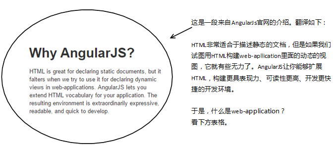
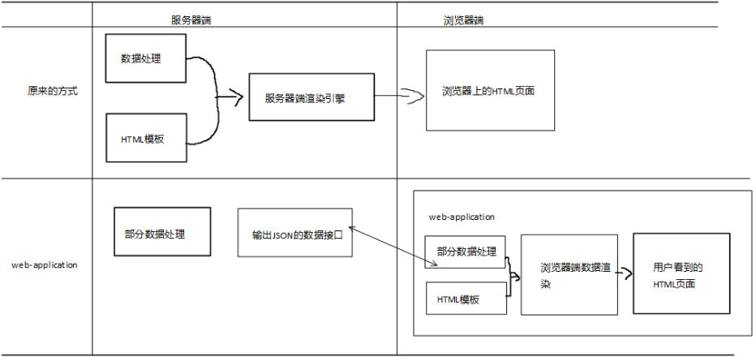
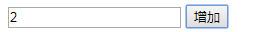
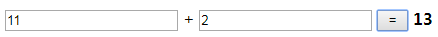
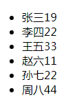

## 概述：Angular与单页面应用程序



web-application: 



## 常规写法和AngularJS的比较

1. 计数器，点击能够自动加1，如下图所示

   

   常规写法的代码如下：

   ```html
   <!DOCTYPE html>
   <html lang="en">
   <head>
       <meta charset="UTF-8">
       <title>传统页面操作数据操作方式</title>
   </head>
   <body>
   <input id="txt_value" type="number">
   <input id="btn_add" type="button" value="增加">
   <script>
       (function (window, document) {
           var txt = document.querySelector('#txt_value');
           var btn = document.querySelector('#btn_add');
           btn.addEventListener('click', function (e) {
               var now = txt.value - 0;
               now = now + 1;
               txt.value = now;
           });
       })(window, document);
   </script>
   </body>
   </html>
   ```

   AngularJS写法的代码如下：

   ```html
   <!DOCTYPE html>
	<html lang="en">
	<head>
	    <meta charset="UTF-8">
	    <title>使用AngularJS实现自增功能</title>
	</head>
	<body ng-app>
		<input type="number" ng-model="value">
		<input type="button" ng-click="value=value+1" value="增加">
		<script src="./angular.js"></script>
	</body>
	</html>
   ```

2. 加法器，能够进行加法运算，如下图所示

  

  常规写法的代码如下：

  ```html
  <!DOCTYPE html>
  <html lang="en">
  <head>
    <meta charset="UTF-8">
    <title>传统方式实现加法运算</title>
  </head>
  <body>
    <input id="txt_p1" type="number">
    <span> + </span>
    <input id="txt_p2" type="number">
    <input id="btn_add" type="button" value=" = ">
    <!-- <input id="txt_result" type="number"> -->
    <strong id="lab_result"></strong>
    <script>
      (function(window, document) {
        var txt1 = document.querySelector('#txt_p1');
        var txt2 = document.querySelector('#txt_p2');
        var lab_result = document.querySelector('#lab_result');
        var btn = document.querySelector('#btn_add');
        btn.addEventListener('click', function(e) {
          var t1 = txt1.value - 0;
          var t2 = txt2.value - 0;
          lab_result.innerHTML = t1 + t2;
        });
      })(window, document);
    </script>
  </body>
  </html>
  ```

  AngularJS写法的代码如下：

  ```html
  <!DOCTYPE html>
  <html lang="en">
  <head>
    <meta charset="UTF-8">
    <title>使用AngularJS实现加法运算</title>
  </head>
  <body ng-app>
    <input id="txt_p1" type="number" ng-model="parameter1">
    <span> + </span>
    <input id="txt_p2" type="number" ng-model="parameter2">
    <input id="btn_add" type="button" value=" = " ng-click="result=parameter1+parameter2">
    <input id="txt_result" type="number" ng-model="result">
    <script src="./angular.js"></script>
  </body>
  </html>
  ```

3. 数据列表，如下图所示

  

  常规写法的代码如下：

  ```html
  <!DOCTYPE html>
  <html lang="en">
  <head>
    <meta charset="UTF-8">
    <title>传统方式实现数据列表呈现</title>
  </head>
  <body>
    <ul id="list"></ul>
    <script>
      (function(window, document) {
        var data = [
          { id: 1, name: '张三', age: 19 },
          { id: 2, name: '李四', age: 22 },
          { id: 3, name: '王五', age: 33 },
          { id: 4, name: '赵六', age: 11 },
          { id: 5, name: '孙七', age: 22 },
          { id: 6, name: '周八', age: 44 }
        ];
        var ulElement = document.querySelector('#list');
        for (var i = 0; i < data.length; i++) {
          var item = data[i];
          var liElement = document.createElement('li');
          liElement.dataset['id'] = item.id;
          var spanElement1 = document.createElement('span');
          var nameNode = document.createTextNode(item.name);
          spanElement1.appendChild(nameNode);
          var spanElement2 = document.createElement('span');
          var ageNode = document.createTextNode(item.age);
          spanElement2.appendChild(ageNode);
          liElement.appendChild(spanElement1);
          liElement.appendChild(spanElement2);
          ulElement.appendChild(liElement);
        }
      })(window, document);
    </script>
  </body>
  </html>
  ```

AngularJS写法的代码如下：

```html
<!DOCTYPE html>
<html lang="en">
<head>
<meta charset="UTF-8">
<title>Angular实现数据列表呈现</title>
</head>
<body ng-app="myApp">
	<ul ng-controller="DemoController">
		<li ng-repeat="item in data" data-id="item.id">
			<span>{{item.name}}</span><span>{{item.age}}</span>
		</li>
	</ul>
	<script src="./angular.js"></script>
	<script>
	(function () {
		angular.module('myApp', [])
		.controller('DemoController', function ($scope) {
			var data = [
				{id: 1, name: '张三', age: 19},
				{id: 2, name: '李四', age: 22},
				{id: 3, name: '王五', age: 33},
				{id: 4, name: '赵六', age: 11},
				{id: 5, name: '孙七', age: 22},
				{id: 6, name: '周八', age: 44}
			];
			$scope.data = data;
		});
	})();
	</script>
</body>
</html>
```

## AngularJS数据双向绑定

1. 代码示例如下：

   ```html
   <!DOCTYPE html>
   <html lang="en">
   <head>
   	<meta charset="UTF-8">
   	<title>01AngularJS绑定示例</title>
   	<!-- 引入AngularJS包 -->
   	<script src="./angular.js"></script>
   </head>
   <!-- 用ng-app指定AngularJS运行于哪个标签上 -->
   <body ng-app>      
       // ng-app: 指定AngularJS框架运行在哪个标签的内部:ng-app属性
       <input type="text" ng-model="demo">     
       // ng-model="demo": 
       // AngularJS内部有一个“JavaScript对象，用于存储数据”，ng-model指定这个对象上的一个属性，和这个标签，进行绑定：
       // 用户有输入时，ng-model指定的那个属性，也随着用户输入进行更改。
       // 当那个属性内部的数据，因为其他原因有更改时，这个更改也会体现在这个标签上。
       <div>{{ demo }}</div>   
       // 关于demo的插值语法：
       // 将model上的属性和这个插值语法进行绑定，网页上不显示插值语法，而是现实对应的数据
   </body>
   </html>
   ```

